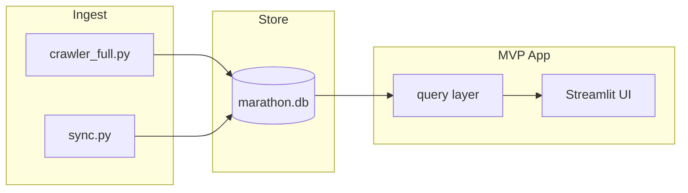

# План реализации MVP (vm_stat)

## Границы MVP

**Входит**

- Надёжный пайплайн данных в [marathon.db](c:\Projects\vm_stat\marathon.db) (существующие скрипты + явная документация запуска).
- **Веб-дашборд** с навигацией по четырём уровням из промпта: **Сезон → Событие → Участник → Команда**, с **основными** метриками (не полный список из раздела «Концепция»).
- Переиспользование SQL из [analytics.py](c:\Projects\vm_stat\analytics.py) (`summary`, карточки события/участника, кубки) — вынести в общий слой запросов, чтобы UI не дублировал строки.

**Не входит (после MVP)**

- Собственная формула рейтинга кубка (сейчас достаточно полей API / `profile_cup_results`).
- Геокарта, push/email-уведомления, экспорт PDF.
- Сбор `GET .../members/?distance=` — только если в MVP явно нужна метрика «запланировано стартов» до публикации результатов; по умолчанию **вне MVP** (опираемся на `competition_stats` / флаги публикации).

**Стек UI (рекомендация MVP)**

- **Streamlit** — один процесс, чтение SQLite, быстрый MVP. В [system_prompt.md](c:\Projects\vm_stat\system_prompt.md) указан как альтернатива FastAPI+React; для MVP Streamlit снижает объём работ.

---

## Этап 1 — Зафиксировать данные и документацию (0.5–1 нед.)

**Цель:** один понятный путь «с нуля до актуальной базы» и «еженедельное обновление».

- Зафиксировать в [README.md](c:\Projects\vm_stat\README.md) или в начале [system_prompt.md](c:\Projects\vm_stat\system_prompt.md) последовательность:
  - первичный залив: [crawler_full.py](c:\Projects\vm_stat\crawler_full.py) (`--only` по этапам при необходимости);
  - регулярно: [sync.py](c:\Projects\vm_stat\sync.py) (флаги из docstring);
  - опционально: [import_profiles_csv.py](c:\Projects\vm_stat\import_profiles_csv.py), [fill_profile_cup_results.py](c:\Projects\vm_stat\fill_profile_cup_results.py) — когда профили/кубки по профилю приходят из CSV или нужен дозаполнительный проход.
- Краткий **data checklist**: наличие `profile_id` в `results` / `cup_results`, заполненность `profiles` и `profile_cup_results` для карточки участника (см. запросы в [analytics.py](c:\Projects\vm_stat\analytics.py) `profile_card`).

**Критерий готовности:** новый разработчик за один сеанс поднимает `marathon.db` и понимает, какой скрипт за что отвечает.

---

## Этап 2 — Слой запросов (аналитика как библиотека) (1 нед.)

**Цель:** UI и CLI используют одни и те же функции/SQL.

- Вынести из [analytics.py](c:\Projects\vm_stat\analytics.py) повторяемые блоки в отдельный модуль, например `marathon_queries.py` (или пакет `queries/`):
  - сводка по базе / по **сезону** (год): события, стартов (строки `results` с `dnf=0`), уникальные `profile_id`, суммарный км через join `distances`, разбивка по `sport` / полу (из `profiles` join `results`).
  - список событий за год (фильтр по `competitions.year`, сортировка по дате).
  - карточка события: переиспользовать логику вокруг `competition_card` (финиши, DNF%, топы по времени — уже частично есть).
  - карточка участника: как `profile_card` (профиль + `results` + `profile_cup_results`).
  - **Команда (MVP-урезание):** агрегация по `results.team` / полю команды из `raw` при необходимости — только если в данных стабильно заполнено; иначе MVP: страница «Команды» с топом по `team` как строке + число финишей и суммарные места/участники без «официального рейтинга команд».
- [analytics.py](c:\Projects\vm_stat\analytics.py) оставить тонкой обёрткой CLI, вызывающей тот же слой.

**Критерий готовности:** Streamlit может импортировать функции и получать `list[dict]` / DataFrame без копирования SQL.

---

## Этап 3 — Streamlit MVP (1.5–2 нед.)

**Цель:** интерактивный дашборд поверх `marathon.db`.

- Зависимости: `streamlit`, `pandas` (опционально для таблиц), путь к БД через `st.secrets` / переменная окружения / дефолт `marathon.db` в корне проекта.
- Структура страниц (боковое меню или вкладки):
  1. **Сезон** — выбор года; метрики MVP: число событий, стартов, уникальных участников, км, разбивка по виду спорта; простая таблица/график «активность по месяцам» из `competitions.date` + count стартов.
  2. **Событие** — выбор года → список соревнований → деталь (как карточка события).
  3. **Участник** — поиск по фамилии/имени (SQL `LIKE` по `profiles`) + ввод id; карточка как в аналитике.
  4. **Команда** — MVP-вариант из этапа 2 (топ команд по числу финишей за выбранный год/сезон).
- Отдельная маленькая страница **«Кубки»** — перенос или ссылка на раздел `cups_report` из [analytics.py](c:\Projects\vm_stat\analytics.py) (для связи концепции «очки в кубках» с UI).

**Критерий готовности:** локальный запуск одной командой (`streamlit run app.py`), без отдельного бэкенда.

---

## Этап 4 — Качество и сдача MVP (3–5 дней)

- Обработка пустой/частичной БД (понятные заглушки в UI).
- Минимальные тесты на слой запросов (pytest + временная SQLite с фикстурой из нескольких строк) для 1–2 ключевых запросов сезона и карточки участника.
- В [system_prompt.md](c:\Projects\vm_stat\system_prompt.md) обновить блок «Следующие шаги»: отметить веб-MVP как сделанный; вынести post-MVP в бэклог.

---

## Риски и смягчение

| Риск                                                  | Действие                                                                                                                  |
| ----------------------------------------------------- | ------------------------------------------------------------------------------------------------------------------------- |
| Пустые `team` в `results`                             | MVP «Команда» — упрощённый топ по непустым значениям + пояснение в UI                                                     |
| Долгий первый импорт / sync                           | Документация только; автоматизация cron — вне кода MVP                                                                    |
| Два источника правды (`profiles.db` vs `marathon.db`) | В документации MVP явно: дашборд только `marathon.db`; [build_refs.py](c:\Projects\vm_stat\build_refs.py) не входит в MVP |

---

## Оценка сроков (при 0.5 FTE)

| Этап                    | Срок         |
| ----------------------- | ------------ |
| 1 Документация + данные | 3–5 дн       |
| 2 Слой запросов         | 5–7 дн       |
| 3 Streamlit             | 7–10 дн      |
| 4 Полировка             | 3–5 дн       |
| **Итого**               | **~4–6 нед** |

Если нужен MVP **только CLI** без веба — этап 3 заменяется на расширение [analytics.py](c:\Projects\vm_stat\analytics.py) (раздел «сезон» + упрощённая команда), срок ~2–3 недели.